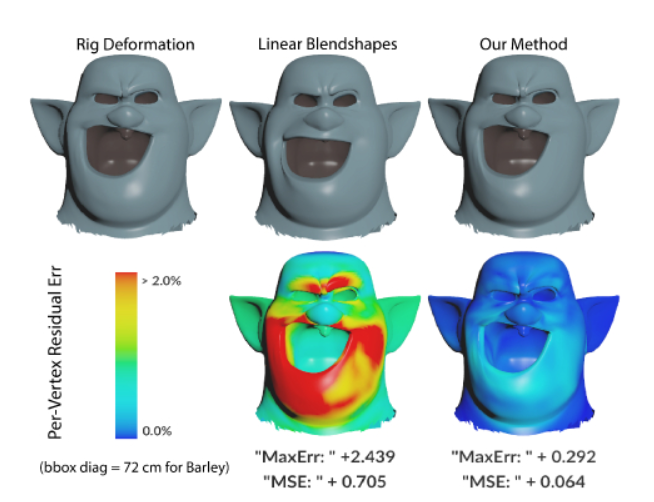
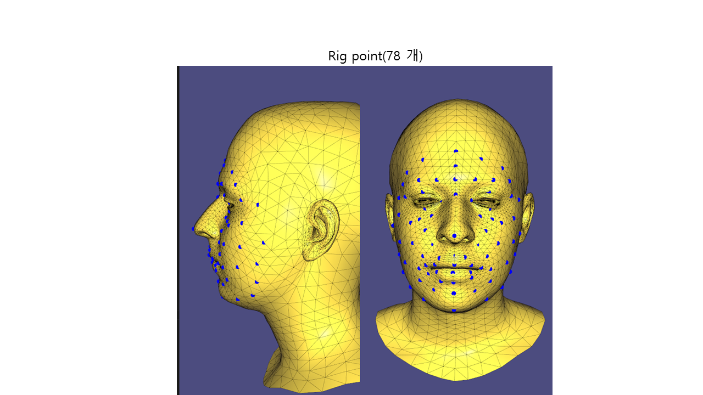
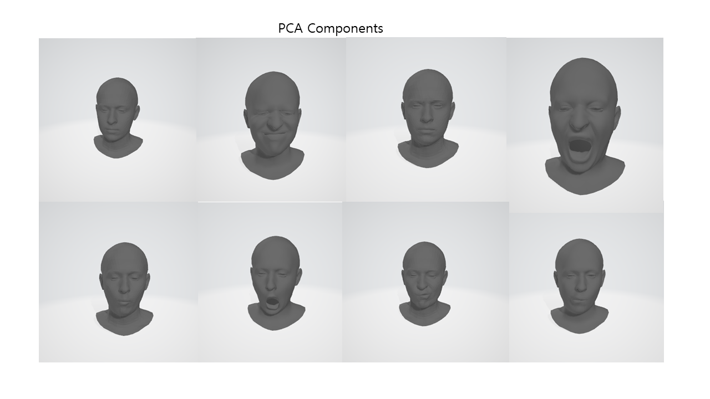
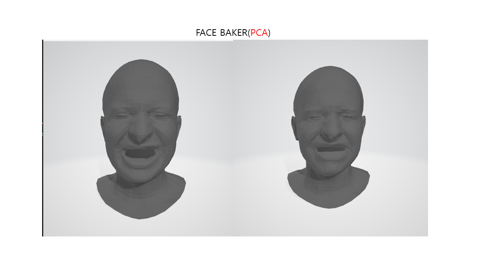

# FaceBaker

This project is an unofficial experimental implementation of Pixar research paper [FaceBaker: Baking Character Facial Rigs with Machine Learning](http://graphics.pixar.com/library/faceBaker/paper.pdf).




yum! its taste is <span style="color:blue">~~malicious~~</span>. **delicious**.

prerequisite
---
install few python library bellow.
```
libigl-python  
tensorflow-2.x  
sckit-learn   
numpy
```


dataset
-----
```
```coma dataset directory structure```
<comment>
coma dataset is not original CoMA dataset, dataset was preprocessed. (removing eyeball, because it's separated.)

<structure>
-coma
  |-bareteeth // mesh category in coma dataset.
    |- bareteeth.000001.obj
        .
        .
        .
    |- bareteeth.000{n}.obj
  |-cheeks_in
  |-eyebrow
  |-high_smile
  |-lips_back
  |-mouth_down
  |-mouth_extreme
  |-mouth_middle
  |-mouth_open
  |-mouth_side
  |-mouth_up
```

```
```KNU dataset```
<comment>
KNU dataset is based on preprocessed ICT-face data. it is blend shape model.

<structure>
-KNU
  |-examples // example of blend shape. originally it used as blend shape. 
                but it used here by example mesh of mesh IK or other things.
    |- example.obj
        .
        .
        .
    |- example{50}.obj
  |-objs // input dataset, it is consists of (V,F) mesh.
    |- {0}.obj
        .
        .
        .
    |- {16900}.obj
  |-reference //reference mesh(every example, objs mesh is same vertex order, and face)
    |-generic_neutral_mesh.obj
  |-weights // mesh based inverse kinematics weights. it was extracted by direct manipulation blendshape.
               see https://citeseerx.ist.psu.edu/viewdoc/download?doi=10.1.1.462.4904&rep=rep1&type=pdf
    |- {0}.txt
        .
        .
        .
    |- {16900}.txt
  |-weightnames.txt // sequence of example's name. 
                    all weighs directory's dataset vector indice is enumerated by weightnames.txt order.

```

preprocess_dataset
---

download and unzip data in ```./data```

then select dataset which you want to train.[ **coma** | **KNU** ]
```
>>> python coma_preprocess.py
```
preprocess coma dataset.

```
>>> python KNUPreprocess.py
```
preprocess KNU dataset.

usage
---

**train**
```
>>> python main.py -n "name" -m train
```


**test**
```<sh>
>>> python main.py -n "name" -m test
```


input data
----


78th rigging point [point_num(78), dims(3) ] is this network's input.

i choose batch size in 5.


result
---
train dataset is ```coma dataset```.
I Chose example for **PCA covariance** randomly.(```KNU dataset``` has its own examples. don't worry to choose examples.)

I use last layer as Dense Layer for testing (Fully Connected Layer in ***Tensorflow 2.x***) according to above photo, it works.




make PCA with 8 examples.
it is same meaning as 
```
sklearn.decomposition.PCA(component=8).inverse_transform(X)
```

result is, see below photo.


(it's looks.... good maybe..?)

According to my thoughts after seeing the results, if you want to use PCA as Last Layer,
***Examples for PCA components should be carefully considered and decided.***


Make Your Own DataLoader
---
**in this moment, data loader and factory is not perfect.**

see class AbstractDataset in **utils.AbstractDataset**
and implements its methods.


if you want to use **DataLoader Factory**.  
see **[utils.dataloader_factory file](./utils/dataloader_factory.py)**