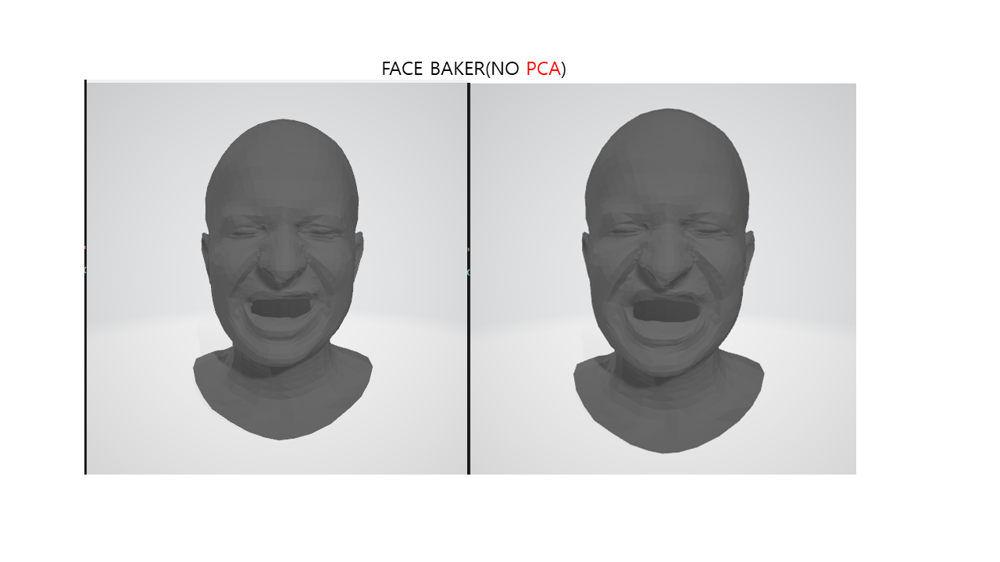

# FaceBaker

This project is an unofficial experimental implementation of Pixar research paper [FaceBaker: Baking Character Facial Rigs with Machine Learning](http://graphics.pixar.com/library/faceBaker/paper.pdf).


preprocess_dataset
---

```
python mesh2npy.py
```

usage
---
```
>>> python main.py
```


input data
----


78th rigging point [point_num(78), dims(3) ] is this network's input.

i choose batch size in 5.


result
---

I use last layer as Dense Layer for testing (Fully Connected Layer in ***Tensorflow 2.x***) according to above photo, it work pretty good.


make PCA with 8 examples.
it is same meaning as 
```
sklearn.decomposition.PCA(component=8).inverse_transform(X)
```

result is, see below photo.


(it's looks.... good maybe..?)

According to my thoughts after seeing the results, if you want to use PCA as Last Layer,
***Examples for PCA components should be carefully considered and decided.***


